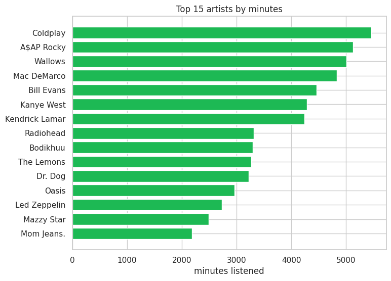
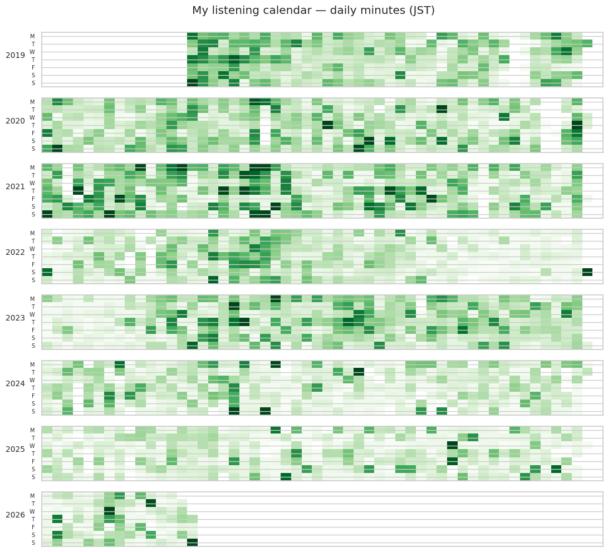
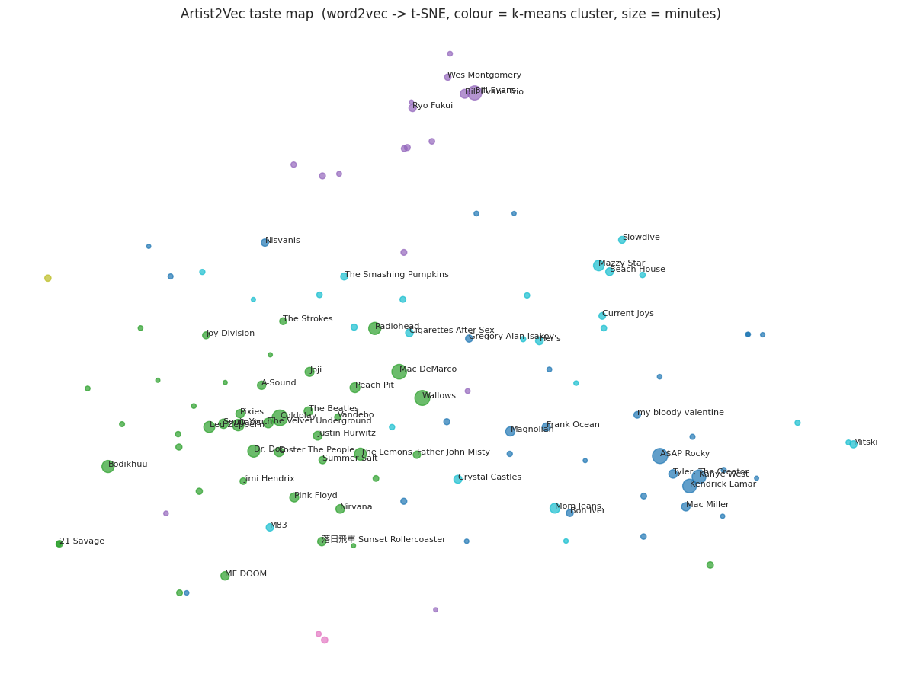

# my-spotify-analysis

Seven years of my Spotify listening history (around 172k plays, 2019 to 2026), pulled
apart with some data science and a bit of machine learning. It is like "Wrapped, but I 
check the maths" + excuse to try ML on data I am interested in.

## Why I made this

I've always been into music, and I also like data, so Spotify Wrapped is kind of
my season finale every year. 
But there was always a small itch at the back of my mind: are these numbers the real story,
or is something behind the curtain influencing the truth? Nothing conspiratorial,
just the ordinary unease of not being able to see how the sausage is made.

Turns out you can just ask. Spotify will send you your entire streaming history, one row
per play, going all the way back to the day you joined. And since I'd
been meaning to practise some ML anyway, the honest version felt like this: compute my own
Wrapped from the raw rows, then keep going and see what else the data has to say.

> **Where it's at:** three notebooks (01 EDA & Wrapped++, 02 prediction, 03 taste
> structure). 

## The notebooks

Each one is self-contained and meant to be read top to bottom. The code lives in the cells
, and the plots are plain
matplotlib/seaborn so they show up in GitHub's notebook preview.

| Notebook | What's in it |
|----------|--------------|
| [**01 EDA & Wrapped++**](notebooks/01_eda_and_wrapped.ipynb) | My own Wrapped, computed from the raw rows: top artists and tracks by minutes (not play count), how listening rises and falls across the years and months, a GitHub-style calendar, a weekly clock in local time, where I was listening from, how many new artists I pick up each month, and the artists I binged for a time. |
| [**02 Prediction**](notebooks/02_prediction.ipynb) | Two questions. First, will I skip this track given only what's known the moment it starts (gradient-boosted trees, about 0.90 PR-AUC, careful about leakage and split by time). Second, can a model guess the year of a session just from its artists? It can, 70% against a 17% baseline, which says my taste has fairly distinct phases. |
| [**03 Taste structure**](notebooks/03_taste_structure.ipynb) | Clustering my sessions into "modes" (deep dives, restless shuffling, background listening), and Artist2Vec: word2vec run over my sessions so artists I play in similar company end up near each other. That gives nicer recommendations, a "blend two artists" trick, and a 2D map of my taste. |

There's also [scripts/make_wrapped.py](scripts/make_wrapped.py) for a quick text Wrapped
in the terminal.

Still on the wishlist: genre enrichment (so I could label the clusters and the years
by genre), a forecast of monthly listening, and a small "explore your own data" Streamlit app.

## The data

When you request it, spotify hands you a folder of JSON files, one object per stream. A
single play looks like this:

```json
{
  "ts": "2024-02-02T06:57:30Z",
  "platform": "ios",
  "ms_played": 120383,
  "conn_country": "JP",
  "ip_addr": "x.x.x.x",
  "master_metadata_track_name": "Our Way to Fall",
  "master_metadata_album_artist_name": "Yo La Tengo",
  "master_metadata_album_album_name": "And Then Nothing Turned Itself Inside-Out",
  "spotify_track_uri": "spotify:track:5CSWXnKRzx7vI4S4JFAunl",
  "reason_start": "appload",
  "reason_end": "trackdone",
  "shuffle": true,
  "skipped": false,
  "offline": false,
  "incognito_mode": false
}
```

The useful bits: when it played (ts, in UTC), how long (ms_played), where
(conn_country), on what device (platform), whether I skipped it, and why it started and
stopped (reason_start, reason_end), plus the track, artist and album. The full field
reference is in [`data_dictionary.md`](data_dictionary.md).

> The raw export includes your IP address and your whole listening history,
> so it's gitignored. Drop your unzipped export into
> data/raw/  A tiny made-up sample lives in data/sample/ so the
> notebooks still run for anyone who clones this.

## What the export doesn't give you

No audio features (energy, tempo, that sort of thing), no genres, no popularity. If I want
those later I'll have to enrich:

- Genres can come from the Spotify artists endpoint, or from MusicBrainz / ListenBrainz
  tags as a backup that doesn't depend on API access.
- Audio features are trickier: Spotify cut off `audio-features` and `recommendations` for
  new apps in late 2024, so I'm treating any enrichment as optional.

## How it's laid out

```
my-spotify-analysis/
├── notebooks/          # 01 EDA & Wrapped++ , 02 prediction , 03 taste structure
├── scripts/
│   ├── helper_scripts.py # loads + cleans the export 
│   └── make_wrapped.py   # quick text Wrapped in the terminal
├── data/
│   ├── raw/            # your spotify export goes here (gitignored)
│   └── sample/         # tiny sample, so the repo runs with examples
├── figures/            # the charts shown at the bottom of this README
├── data_dictionary.md  # data dictionary
└── requirements.txt
```

The data flows from data/raw/*.json through load_streams and clean_streams (both in
scripts/helper_scripts.py), and the notebooks take it from there. I kept all the analysis inline in
the notebooks, so the only shared code is that one small loader.

## A few of my favourite charts


  <br>
  My top artists over seven years, ranked by minutes actually listened rather than play count.


  <br>
  Every day I listened, GitHub style, one block per year (in JST). You can spot the busy stretches and the quiet ones.


  <br>
  Artist2Vec: every artist embedded with word2vec and squished down to 2D. Colour is an automatic cluster, size is minutes listened (notebook 03).

**Stack:** Python 3.12, pandas, scikit-learn, matplotlib and seaborn, plus gensim for the
embeddings.

## Running it

I used a conda env pinned to Python 3.12

```bash
conda create -y -n spotify python=3.12
conda activate spotify
pip install -r requirements.txt
```

Put your unzipped export in `data/raw/` (or just leave it in `my_spotify_data/`, the loader
checks both), then open the notebooks with jupyter lab and run them top to bottom. For a
quick text summary without opening anything:

```bash
python scripts/make_wrapped.py
python scripts/make_wrapped.py --year 2025
```

> **On timezones:** the timestamps are UTC
